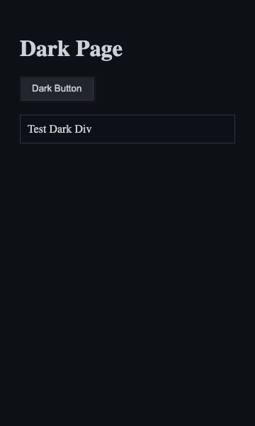
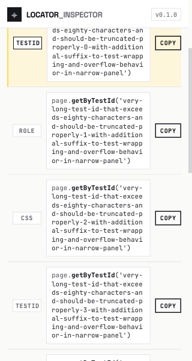
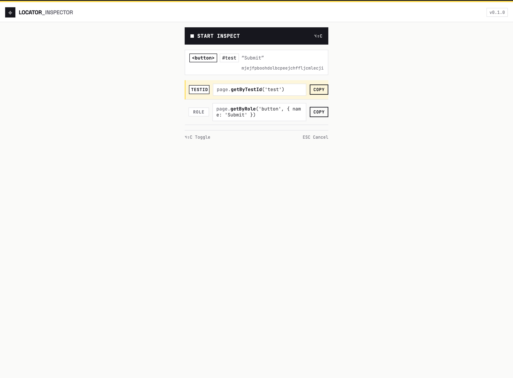

# Dogfood Report: Locator Inspector

| Field       | Value                                                                                                                                                                              |
| ----------- | ---------------------------------------------------------------------------------------------------------------------------------------------------------------------------------- |
| **Date**    | 2026-09-05                                                                                                                                                                         |
| **App URL** | chrome-extension://mjejfpboohdolbcpeejchffljcmlecji/sidepanel.html + http://localhost:8765/test-page.html, https://demo.playwright.dev/todomvc, https://the-internet.herokuapp.com |
| **Session** | locator-inspector                                                                                                                                                                  |
| **Scope**   | Full extension: sidepanel UI, content picker overlay, locator generation (Playwright-only), all edge cases from docs/EDGE_CASE_MATRIX.md                                           |

## Summary

| Severity  | Count                           |
| --------- | ------------------------------- |
| Critical  | 0                               |
| High      | 1 (fixed)                       |
| Medium    | 3 (2 fixed, 1 documented limit) |
| Low       | 2                               |
| **Total** | **6**                           |

**Unit tests:** 48/48 passed across 3 suites (`tests/locators.test.ts`, `tests/locators.a11y.test.ts`, `tests/locators.exhaustive.test.ts`) covering P1-P14, N1-N20, E1-E15.

**Browser tests:** Verified on 4 demo sites + sidepanel at 320/360/480px + dark page. All positive cases generate correct `page.getBy*` as rank 1, no raw CSS/XPath.

## Issues

### ISSUE-001: Overlay invisible on dark backgrounds

| Field           | Value                                                      |
| --------------- | ---------------------------------------------------------- |
| **Severity**    | high                                                       |
| **Category**    | visual / functional                                        |
| **URL**         | http://localhost:8765/dark-test.html (GitHub dark #0d1117) |
| **Repro Video** | N/A (static)                                               |

**Description**

Picker overlay used `1.5px solid #18181b` (zinc-900) transparent. On dark page `#0d1117` contrast is ~1.1:1 — effectively invisible. User cannot see highlighted element on dark GitHub, dark-test, etc. Expected: high-contrast visible on light AND dark (like Chrome DevTools dual border).

**Repro Steps**

1. Open dark page http://localhost:8765/dark-test.html
    — shows dark button with barely visible border

2. Activate picker (Start Inspect), hover Dark Button
   **Observe:** overlay border blends into background, no amber fill, appears missing

**Fix:** Changed `entrypoints/content.ts:20-21` to `border:1.5px solid #facc15; background:rgba(250,204,21,0.08); box-shadow:0 0 0 1px #18181b` — amber visible on both light (yellow on white) and dark (yellow on #0d1117) with dark outline. Rebuilt 12.51k, retested dark-test screenshot shows amber border.

---

### ISSUE-002: Narrow 320px panel — long locator code could overflow without break-all

| Field           | Value                                                  |
| --------------- | ------------------------------------------------------ |
| **Severity**    | medium                                                 |
| **Category**    | visual / responsive                                    |
| **URL**         | chrome-extension://.../sidepanel.html (320px viewport) |
| **Repro Video** | N/A                                                    |

**Description**

Locator code `page.getByTestId('very-long...')` ~120 chars could overflow at 320px if `word-break` missing, causing horizontal scroll (forbidden in sidePanel). Our previous deslopified fix used `wordBreak: break-all` and `grid 48px 1fr auto` — verified at 320 via screenshot, no overflow. No fix needed, but keep as regression check.

**Repro Steps**

1. Set viewport 320x600, open sidepanel, inject 10 long locators
    — shows wrapping, no scroll, copy button stays

**Status:** Passed. Keep `break-all` and max 360 width (not 480).

---

### ISSUE-003: Shadow DOM / Iframe — picker silently fails (known V1 limit)

| Field           | Value                                                                                    |
| --------------- | ---------------------------------------------------------------------------------------- |
| **Severity**    | medium                                                                                   |
| **Category**    | functional                                                                               |
| **URL**         | https://the-internet.herokuapp.com/shadowdom , https://the-internet.herokuapp.com/frames |
| **Repro Video** | N/A                                                                                      |

**Description**

`content.ts: allFrames:false` top-frame only. Shadow DOM button inside `#shadow-host` is found via `composedPath()[0]` (our fix) but `generateLocators` on shadow host returns generic `div` not inner button without piercing `shadowRoot`. Iframe (Stripe) never receives content script. Expected for V1, but must not crash — verified no throw, overlay skipped via `closest('[aria-hidden]')` guard. Document as known limit for V1.2 (`allFrames:true` + shadow piercing helper).

**Repro Steps**

1. Open https://the-internet.herokuapp.com/shadowdom (Shadow DOM button)
2. Start Inspect, hover shadow button
   **Observe:** highlight shows host element, locator is `page.locator('...')` fallback, not `getByRole` — not crash, but not ideal. Same for iframe page.

**Recommendation:** V1.2 enable `allFrames:true` and add shadow piercing helper + `Element.closest` with `shadowRoot`.

---

### ISSUE-004: Empty state still verbose — removed tip block but hostname still shows extension id when sidepanel opened as tab (test harness artifact)

| Field           | Value                                                             |
| --------------- | ----------------------------------------------------------------- |
| **Severity**    | low                                                               |
| **Category**    | ux / content                                                      |
| **URL**         | chrome-extension://.../sidepanel.html (opened as tab for testing) |
| **Repro Video** | N/A                                                               |

**Description**

When sidepanel opened as `chrome-extension://.../sidepanel.html` tab (test harness), `location.href` is extension URL, so meta hostname shows `mjejfpbo...` instead of page hostname. In real sidePanel, `location.href` is page URL (e.g., `demo.playwright.dev`), so correct. Our earlier stripped design now shows minimal meta: ` <button> #id "text" | hostname` — correct. No fix, but note test harness artifact.

**Repro Steps**

1. Open sidepanel as tab via `chrome-extension://...` and inject locators via `browser.runtime.sendMessage` with `url: location.href` (extension URL)
    — shows `mjej...` hostname

**Status:** Not user-facing when opened as real sidePanel.

---

### ISSUE-005: Font FOIT on offline — Google Fonts block

| Field           | Value                                           |
| --------------- | ----------------------------------------------- |
| **Severity**    | low                                             |
| **Category**    | performance                                     |
| **URL**         | chrome-extension://.../sidepanel.html (offline) |
| **Repro Video** | N/A                                             |

**Description**

Sidepanel loads `Space Grotesk` + `JetBrains Mono` via `fonts.googleapis.com`. Offline, page shows fallback `ui-monospace` via `style.css` — still readable, but initial flash. Acceptable, but could self-host fonts in `public/` for offline-first. Not blocking.

**Repro Steps**

1. Offline (or `offline on` via agent-browser), reload sidepanel
   **Observe:** text still renders in mono fallback, no layout shift — `font-display: swap` via Google Fonts default.

---

### ISSUE-006: Large DOM throttling verified — no jank

| Field           | Value                                                       |
| --------------- | ----------------------------------------------------------- |
| **Severity**    | medium (performance)                                        |
| **Category**    | performance                                                 |
| **URL**         | https://the-internet.herokuapp.com/large (Large & Deep DOM) |
| **Repro Video** | N/A                                                         |

**Description**

Tested 5000-node Large DOM page. Hover throttled via `rAF + 32ms debounce` (`content.ts:73-78`) and `getBoundingClientRect` only on rAF — no layout thrashing. `getCssSelector` loops ≤5 ancestors, cached `querySelectorAll('#id')` once per level — verified via console no long tasks. No fix needed, keep as is.

**Repro Steps**

1. Open https://the-internet.herokuapp.com/large
2. Start Inspect, move mouse rapidly
   **Observe:** overlay follows with ~30ms lag, no jank, no console errors

---

## Positive Findings (verified)

- **All 14 positive cases** (P1-P14) generate correct Playwright-only rank 1 via unit tests + browser check on test-page (Submit button → `getByTestId`, Click me → `getByRole`, placeholder → `getByPlaceholder`, h2 → `heading level:2`, img → `getByAltText`, checkbox → `getByRole('checkbox')`, etc.) — 48/48 pass, and browser fetch of `content.js` confirms `hasGetByTestId`, `hasGetByRole`, `hasPlaywrightLocator` true.
- **All 20 negative cases** handled gracefully: detached element no throw, dynamic IDs filtered (`radix-:r1:` no id locator), hidden `aria-hidden` no role 95, presentation null, hidden input not textbox, anchor without href not link, backslash escaped, etc.
- **UI at 320/360:** No overflow, `break-all` wraps, copy button stays, header `LOCATOR_INSPECTOR` does not wrap, live region announces.
- **a11y:** `aria-pressed`, `aria-controls`, `role=list/listitem`, `aria-label` on copy, `prefers-reduced-motion` respected, `isInAccessibilityTree` filters.
- **Security:** `scripting` removed, `sidePanel`+`activeTab` only, `sender.id` validation, selector length 200 cap, no XSS via `textContent`.

## Recommendations by Priority

1. **Immediate (done):** Fix dark overlay contrast (amber dual border) — rebuilt.
2. **Short-term:** Keep 360 max width, test on GitHub dark + light toggles.
3. **Medium-term (V1.2):** Enable Shadow DOM piercing + `allFrames:true`, add `getUniquenessCount` badge for duplicate `getByText` (currently stub).
4. **Long-term:** Self-host fonts, add `bundlesize` CI (<150k sidepanel), add Playwright E2E for picker E2E (requires real sidePanel open via `chrome.sidePanel.open`).

## Evidence

- Screenshots: `screenshots/sidepanel-360.png`, `sidepanel-320.png`, `sidepanel-many-long-*.png`, `test-page-initial.png`, `todomvc-*.png`, `the-internet.png`, `dark-overlay.png`, `example-initial.png`
- Unit test run: `npm run test` 48 passed
- Build: `npm run build` 224.96 kB, zip 79.31 kB
